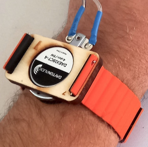

# Staccato
<!--  -->

A Max package created during the *Staccato* project, providing a framework for the design of audio-to-vibrotactile signal transformation.

## How to install

To use this package, you will need to install the following:
- get and install the latest release from Max at [https://cycling74.com](https://cycling74.com) ;
- get the latest release from MVC package at the [release page](https://github.com/vincentgoudard/MVC/releases) 
  - (or if you are more confident : clone it or fork it from [this page](https://github.com/vincentgoudard/MVC));
- get the latest release from MVC-components package at the [release page](https://github.com/vincentgoudard/MVC-Components/releases) 
- put these packages in your Max document folder (`home/Documents/Max 8/Packages`);
- that's it.

The Staccato package has been developed with Max 8.6.1 and MVC package version 0.1

## Dependencies

- No externals are used in this package, it's all Vanilla Max.
- Nevertheless, the brace expansion used throughout MVC components runs in a [node script](https://docs.cycling74.com/max8/refpages/node.script) that relies on the [braces](https://www.npmjs.com/package/braces) package. This package is automatically fetched and installed on the first use of `mvc.device`.

## How to use it
The documentation is mostly included in the help patchers (in the `/help` folder) and the example patchers (in the `/example` folder).

## Hardware

The following hardware was used during the Staccato project. Although the algorithms contained in the package are not limited to this hardware setup and should be easily adaptable, this gives an idea about how the software can be used.

### Audio interface
The setup used included an audio interface with multi-channel outputs, so that audio and vibrotactile signals can be sent to different audio outputs. Namely, we used a RME fireface UC and used the first pair of channel for audio output and the following channels for vibrotactile signal output.

### Vibrotactile bracelets
Custom vibrotactile bracelets (see picture) have been designed during the *Staccato* project, that have been used with this package. The vibrotactile bracelets could be adjusted thanks to magnetic steps. It embedded a small vibrotactile transducer, model DAEX19CT-4 from [Dayton-Audio](https://www.daytonaudio.com/) (4 ohms, 5W). This transducer was powered with a regular audio amplifier (we used both Thomann's "t.amp TA50" and FX-Audio's "FX1002A")

### Subpac
The commercial vibrotactile-backpack interface known as ["Subpac"](https://subpac.com) was also used as an audio transducer, driven with custom-made vibrotactile signals, in place of the expected audio input. The headphone thru-put of the Subpac was discarded in such a configuration.

### Other
We also tested various other speakers encapsulation such as wrapping it into foam-balls (so that it can be touched/handled with the hands), or into a cushion (so that it can be placed under the head or neck), placing it onto a table, seat or floor, so that one can lie down and feel the vibration through multiple location on the body.  

## Credits
The *Staccato* project was funded by the french National Research Agency (ANR-19-CE38-0008).

## References

- David M. BIRNBAUM, Musical Vibrotactile Feedback, Montreal, McGill University, 2007.
- Pascale CRITON, « Listening otherwise. Playing with vibrations », Athens, Proceedings ICMC, 2014
- Hugues GENEVOIS, Benoît NAVARRET et Gabriela PATIÑO-LAKATOS. “De la sensation à la sémiotique vibrotactile. Médiations pour l’expérience musicale”. In : Hybrid. Revue des arts et médiations humaines 6 (2019). Publisher : Presses Universitaires de Vincennes.
- Nazim Gizem FORTA. “Vibration intensity difference thresholds”. PhD Thesis. University of Southampton, 2009.
- Saúl MATÉ-CID. Vibrotactile perception of musical pitch. The University of Liverpool (United Kingdom), 2014.
- Sebastian MERCHEL et M Ercan ALTINSOY. “Psychophysical comparison of the auditory and tactile perception : a survey”. In : Journal on Multimodal User Interfaces 14 (2020). Publisher : Springer, p. 271-283.
- John W. MORLEY et Mark J ROWE. “Perceived pitch of vibrotactile stimuli : effects of vibration amplitude, and implications for vibration frequency coding.” In : The Journal of physiology 431.1 (1990).
- Jordi NAVARRA, Salvador SOTO-FARACO et Charles SPENCE. “Adaptation to audiotactile asynchrony”. In : Neuroscience letters 413.1 (2007).
- Stefano PAPETTI, Charalampos SAITIS. Musical haptics. Springer Nature, 2018.
- Mario PRSA et al. “A common computational principle for vibrotactile pitch perception in mouse and human”. In : Nature communications 12.1 (2021). Publisher : Nature Publishing Group UK London, p. 5336.
- Byron REMACHE-VINUEZA et al. “Audio-tactile rendering : a review on technology and methods to convey musical information through the sense of touch”. In : Sensors 21.19 (2021).
- Ronald T. VERRILLO. “Vibration sensation in humans”. In : Music Perception 9.3 (1992). Publisher : University of California Press, p. 281-302.
